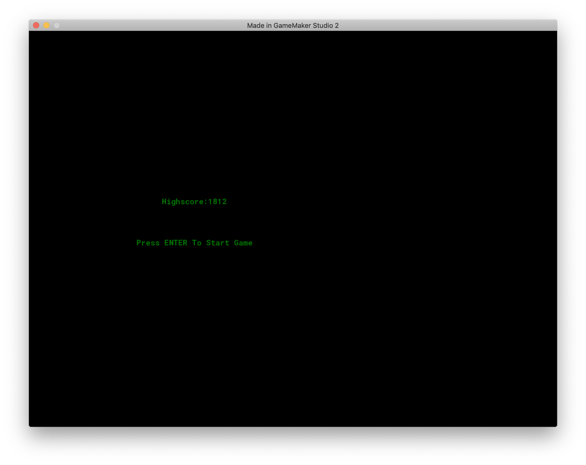
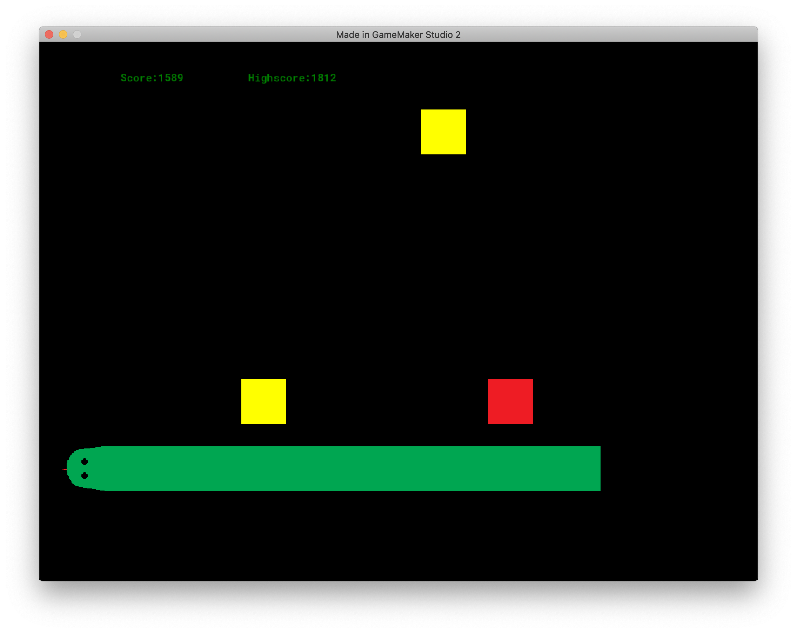
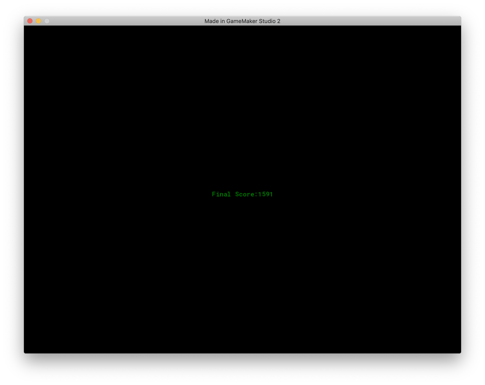

**Snake Game**

Based on Ben Tyers [Practical GameMaker Projects](https://www.amazon.com/Practical-GameMaker-Projects-Build-Studio/dp/1484237447) Chapter 3.

Notes:

* Did not use any fonts, backgrounds nor sounds
* Created my own graphics
* Good example of high score, room movement (start, game, end)
* Has an enum and uses alarms
* Did not do room size change

Dislikes (or things to improve):

* When you hit something (outside room, block, or tail), it does not show "right"
* Static game (could make blocks appear randomly)
* No levels
* Size of objects are too big (just used default 64x64)
* Start/Game Over pages need some work

Here are some screenshots: 

